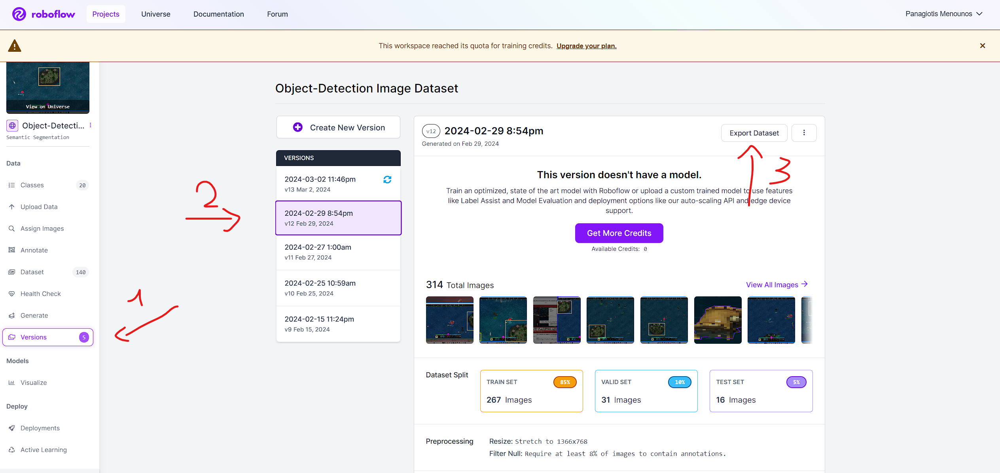
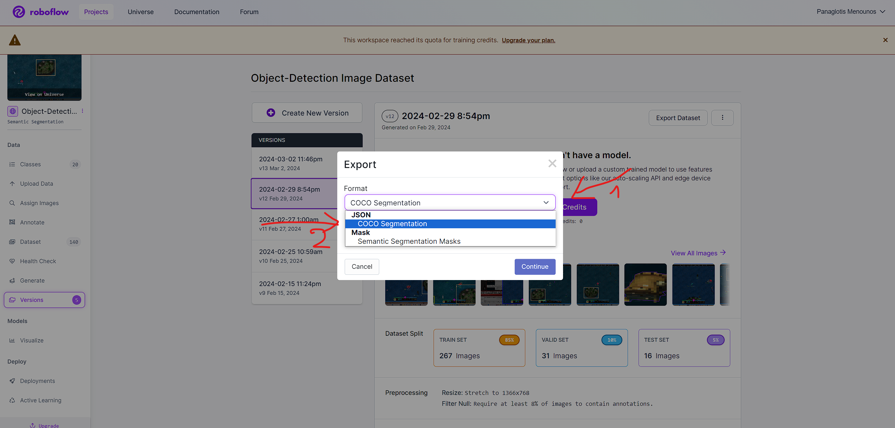
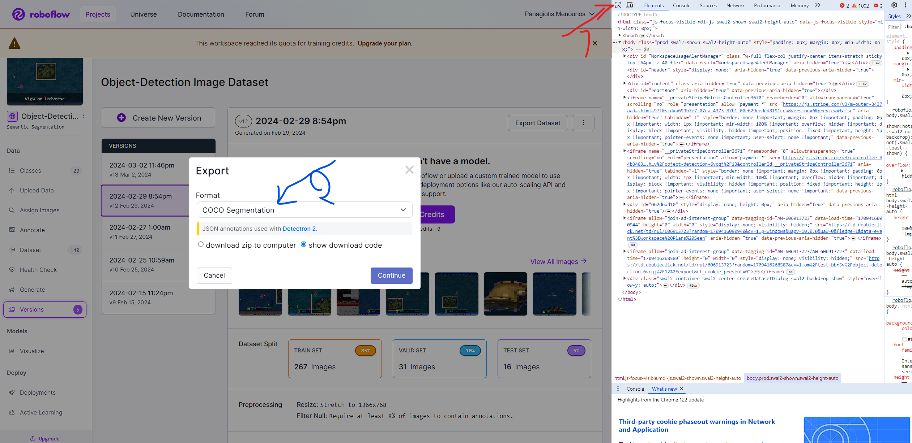
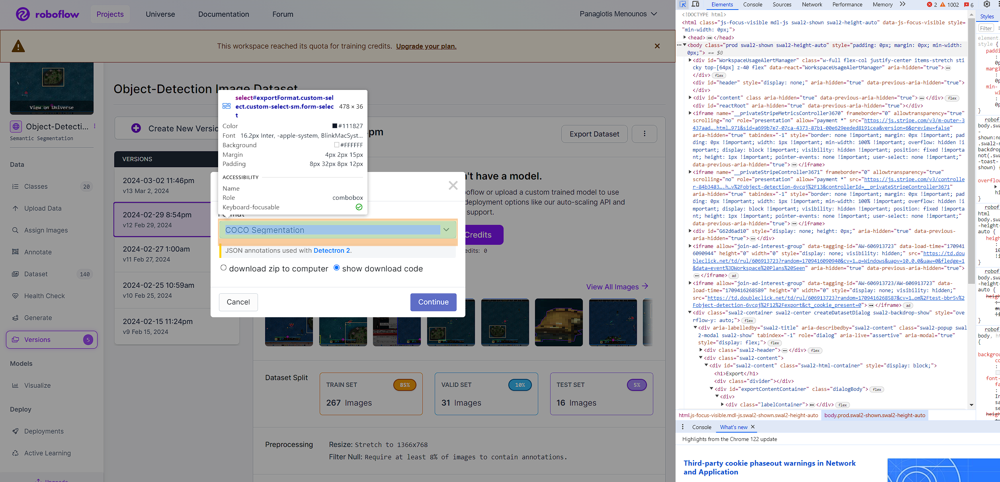
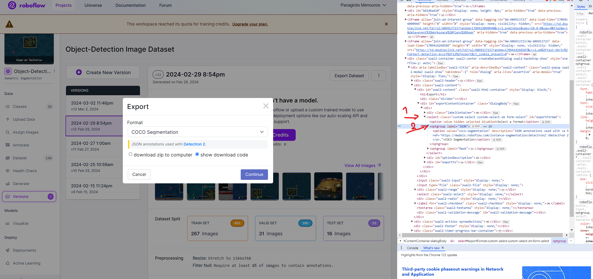
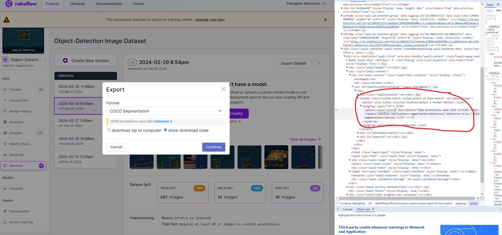
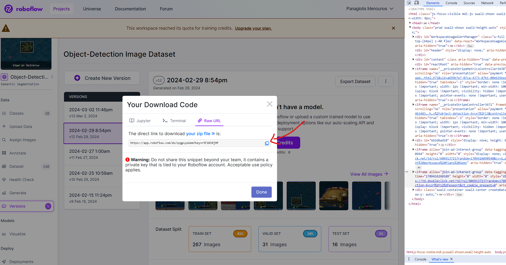

# Roboflow Hack in order to download YOLOV8 Format

This is because the project setup was not correct, if you create a new project no need to go this way but we will lost all the work

 
Press F12
 
 
 
* Rename the JSON --> TXT
* Rename the coco-segmentation --> yolov8  

  
  
Press Continue 

 
  
Copy the link and download