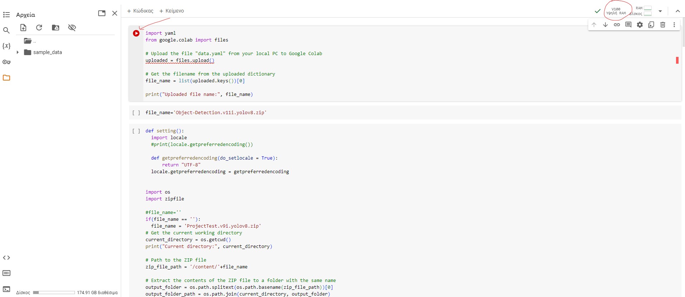
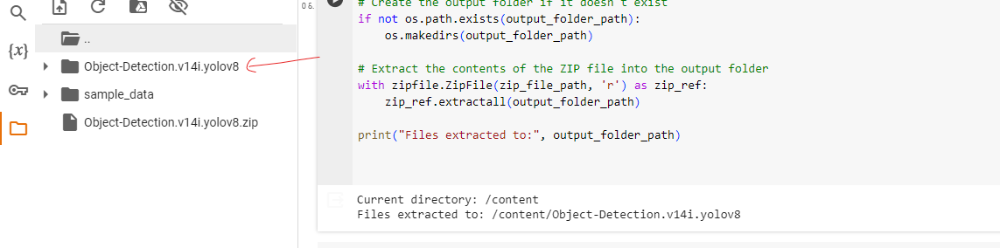

# Model Training Process for Dataset

This repository contains instructions and code for training your model using Google Colaboratory.

## Getting Started

1. **Upload Dataset**: Run the first cell and upload the zip file containing your dataset from Roboflow.
   - Premium users have access to A100 GPU with 40GB RAM, while the free version offers T4 GPU with 15GB RAM.
   

2. **Wait for Completion**: Allow the process to complete successfully.
   

3. **Unzipping and Encoding**: Once completed, find the zip file. The provided code unzips the file and modifies the encoding. Note: This step isn't required locally due to preselected configurations in Google Colaboratory.
   

4. **Folder Organization**: The unzipped files are organized within the designated folder:
   

5. **Installation and Training**: Run the pip install command. Then select the subsequent cell to begin training.
   - **Epochs**: Number of loops.
   - **imgsz**: Image analysis (in pixels). Larger values yield better results, especially for fine details like glitters (e.g., with a pixel size of 80x100).
   

6. **Successful Training**: This index is the most valid of successful training.
   

7. **Download Best Model**: Finally, you have to download this best.pt file.
   
