# Roboflow Hack in order to download YOLOV8 Format

This is because the project setup was not correct, if you create a new project no need to go this way but we will lost all the work

if you want to export a dataset. You have to go in versions and select the new version first:

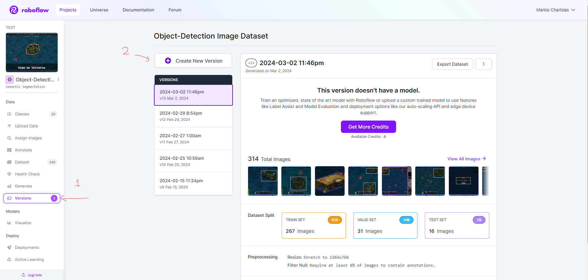

then you can check the images and continue 

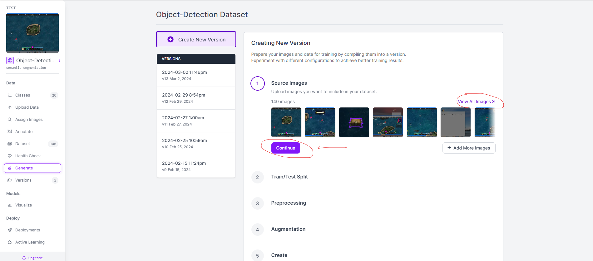

at step 2 you split the iamges to train , valid and test ( a common split ratio is 60% training, 20% validation, and 20% testing. )

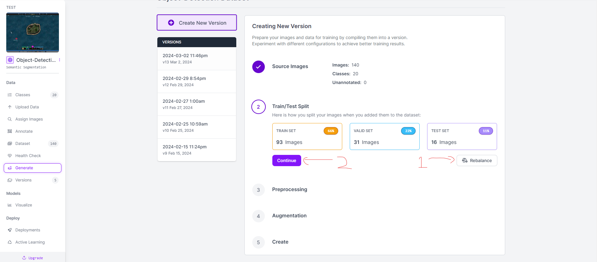

at step 3 you can produce more data using the (Add Preprocessing step according to your project). 
in our case we have the null object and resize into most common display screen after the 1920x1080
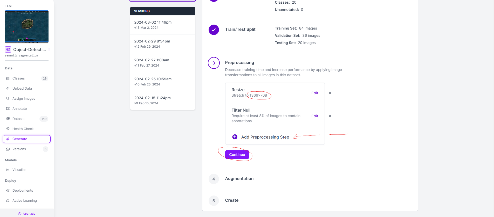

at step 4 you choose augmentation that produces even more data based on previous preprocessing steps. We choose rotation -8 and 8 degrees because of geometry transformations 
in game. Too much preprocessing and augmentations will confuse the model if those changes are not be corresponses to actual game

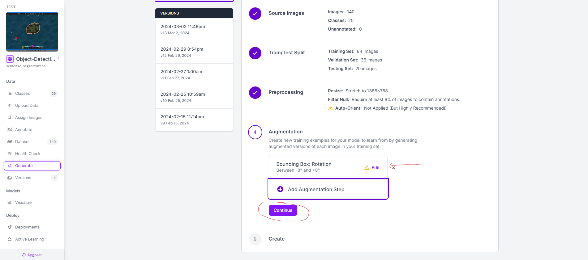

at step 5 you can create the new version of dataset:
free version allows 3x multiplication images to be created
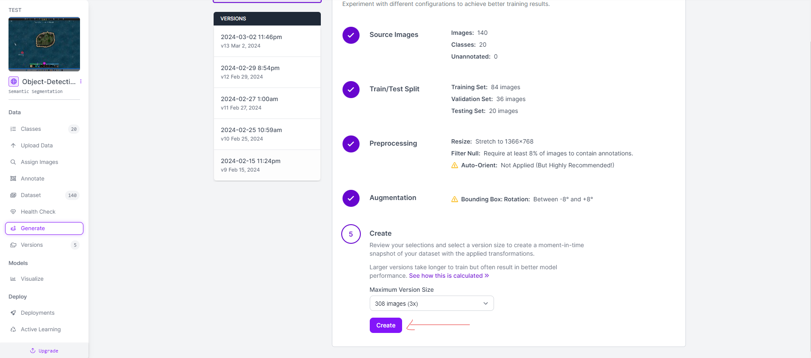

and then you download the new version:

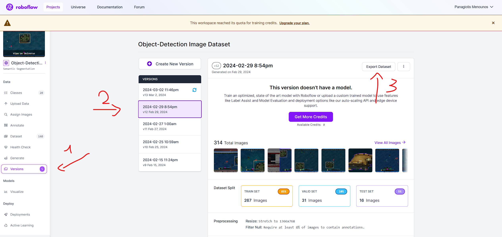
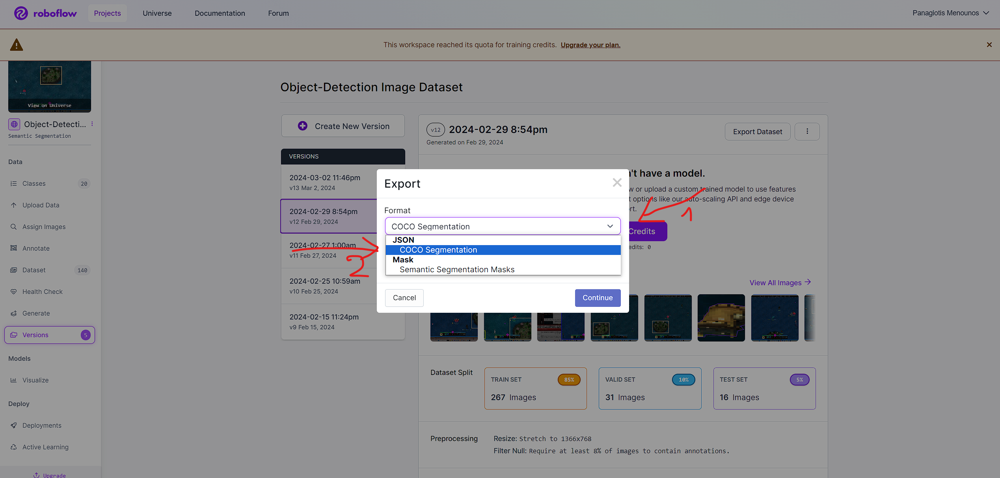 
Press F12
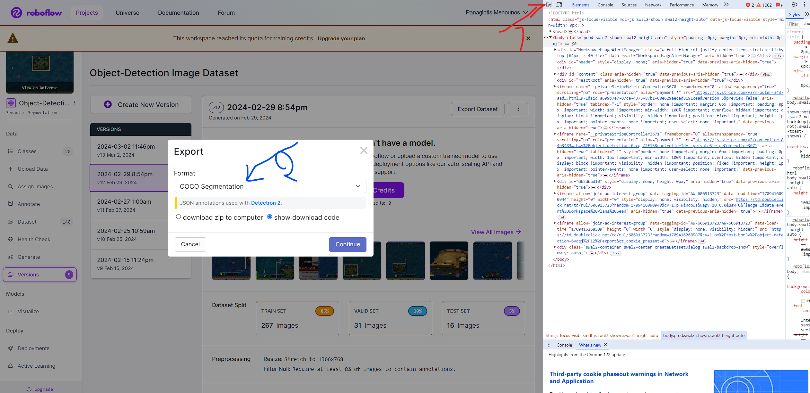 
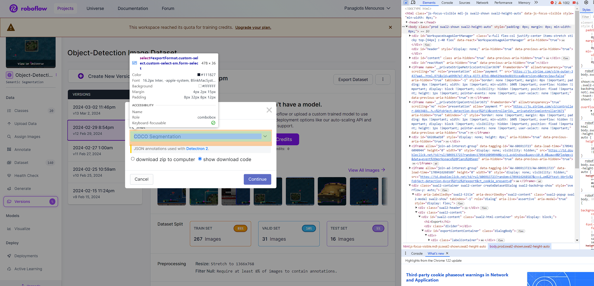 
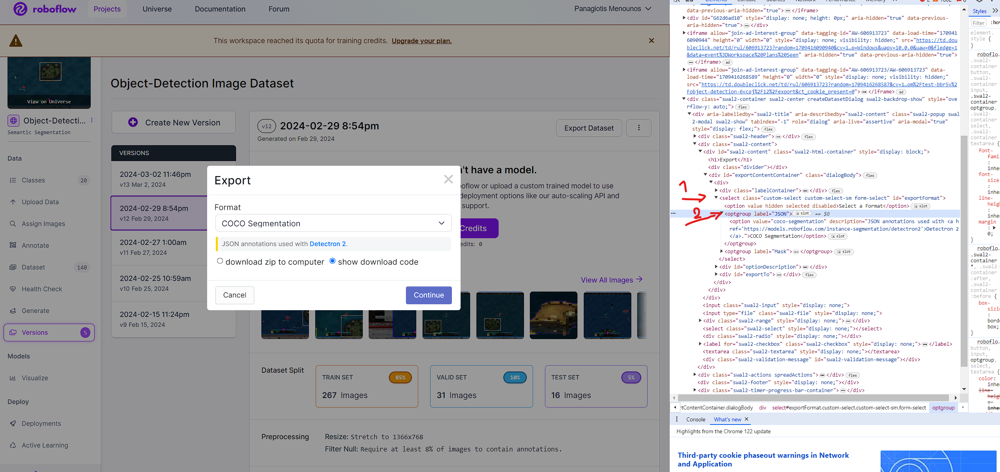 
* Rename the JSON --> TXT
* Rename the coco-segmentation --> yolov8  

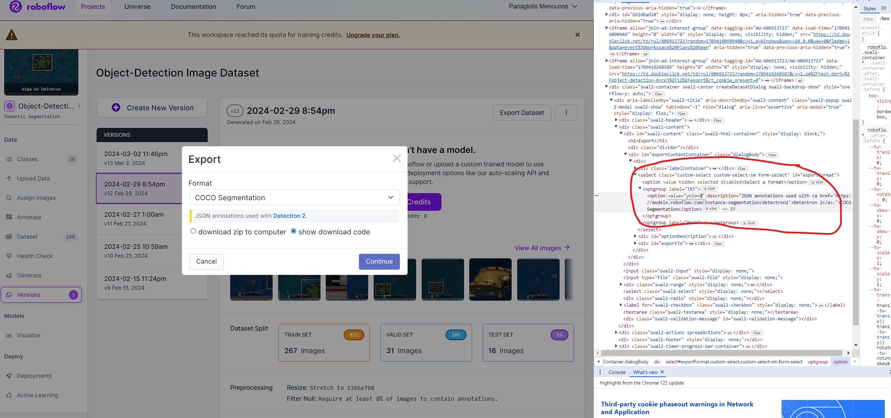  
  
Press Continue 

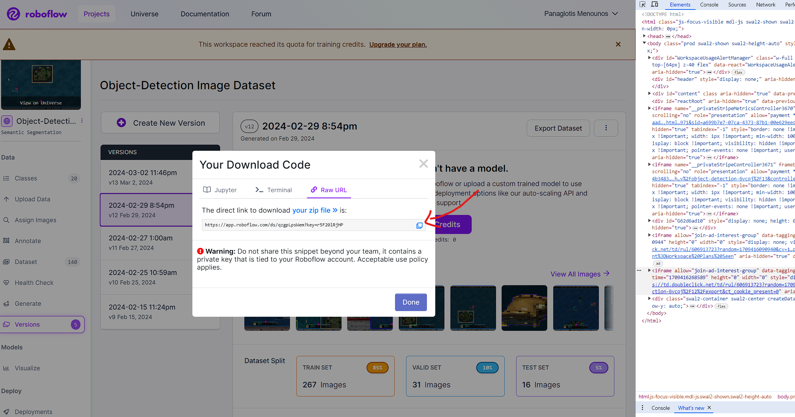 
  
Copy the link and download