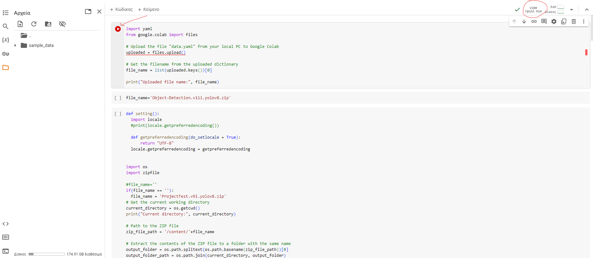
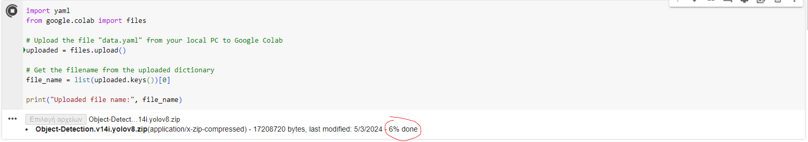
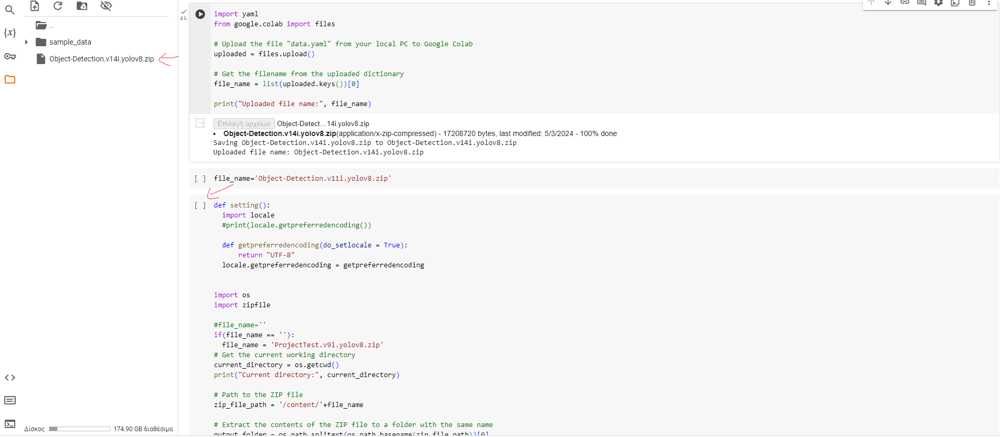
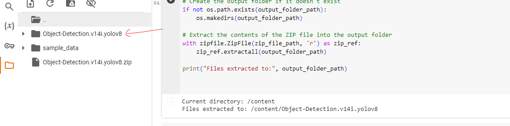

# TrainModel process of dataset

This page contains all the related info on how to train the model in Google Colaboratory

You run the first cell and by upload select the zip file that you have already downloaded from roboflow.
 At right corner you see the gpu or cpu that you use for training A100 is for premium users with ram 40GB
 T4 is free version with 15GB

wait until this completes successfully

after that you can see the zip file. The code bellow unzip the file and define a function to change the encoding
for the testing (no need to do that in locally) because of the google colaboratory preselected settings

as you can see the file unziped to the folder:

then you run the pip install and when this completes you choose the other cell to run the training
epochs are the loops
imgsz is the analysis (px) of the images that you probably need to detect 
in our case we have glitters in pixel size (80*100), so the larger the imgsz is the better results would give
