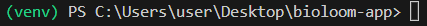
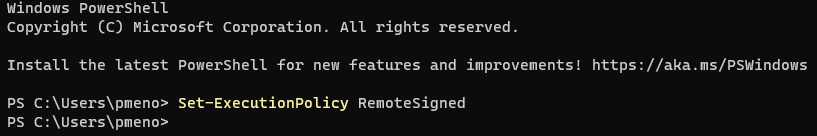
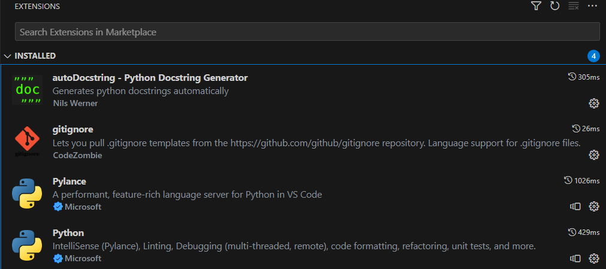
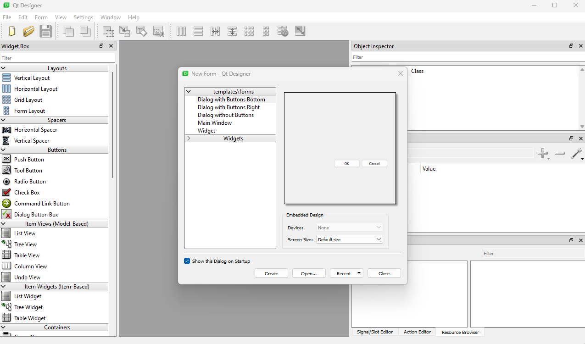
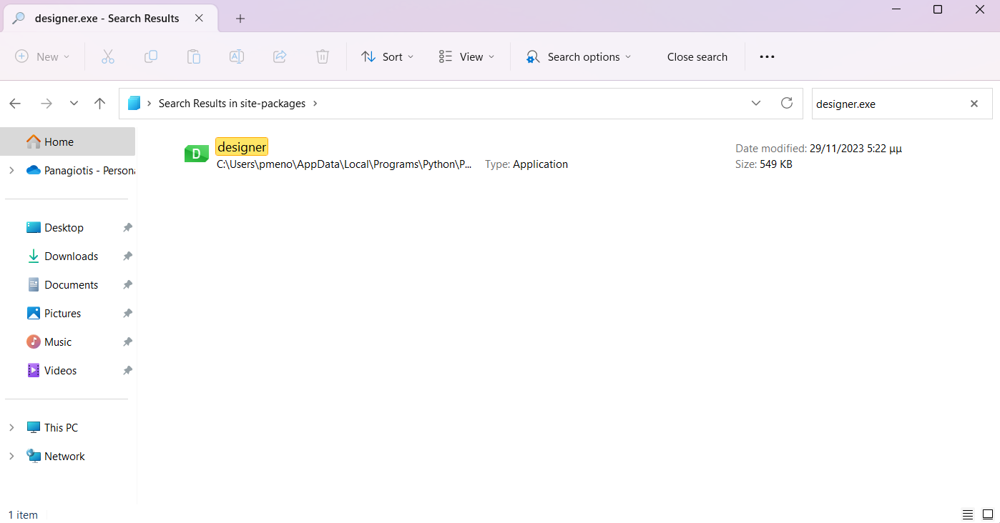
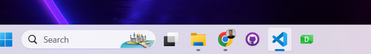

## Setup VS-Code
* Make sure to have a Python 3.8 installed
* Create a virtual environment with the following commands:  
```
python -m venv ./venv 
```
```
.\venv\Scripts\Activate.ps1
```


If you encounter any permissions issues (like a script execution policy error), you might need to adjust your PowerShell execution policy. You can do this by running:  
```
Set-ExecutionPolicy RemoteSigned
``` 
or   
```
Set-ExecutionPolicy Unrestricted
```


## VS-Code extensions

* Python
* Pylance
* gitignore
* autoDocstring



## Project documentation

There is a couple ways to document the code: 

1. Comments
2. Type Hints
3. Docstrings
4. Chat-GPT
5. mkdocs 

## Qt Designer
In order to install the Qt Designer tool open PC terminal as admin and run:

```
pip install pyqt5-tools
```
  

Now you can run the QtDesigner with the following command:
```
pyqt5-tools designer
```


Locate to you python installation to the following example path:  
**C:\Users\pmeno\AppData\Local\Programs\Python\Python38\Lib\site-packages**  

Search for: `designer.exe`  


Pin this app to your taskbar in order to use the app without the command.



## References

[1] ArjanCodes (2023). *How to Document Your Code Like a Pro* [[Video](https://www.youtube.com/watch?v=L7Ry-Fiij-M)]. YouTube.  
[2] SkillsHats. (2023). *Auto Generated Documentation using MkDocs + MkDocStrings | Python* [[Video](https://www.youtube.com/watch?v=Q9wMAv5airg)]. YouTube.  
[3] James Willett. (2023). *How To Create STUNNING Code Documentation With MkDocs Material Theme* [[Video](https://www.youtube.com/watch?v=Q-YA_dA8C20)]. YouTube.  


  